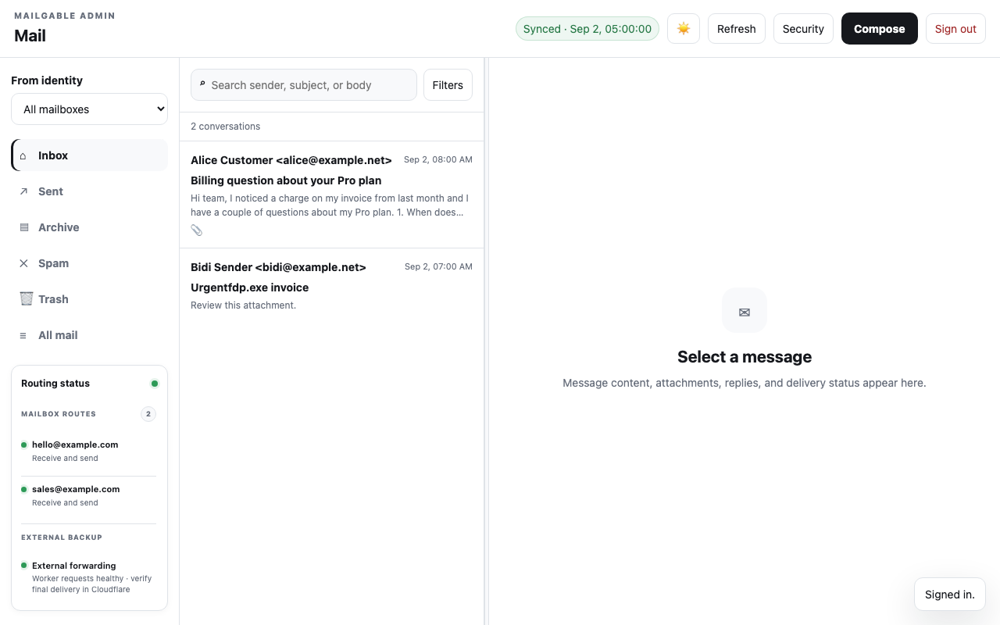
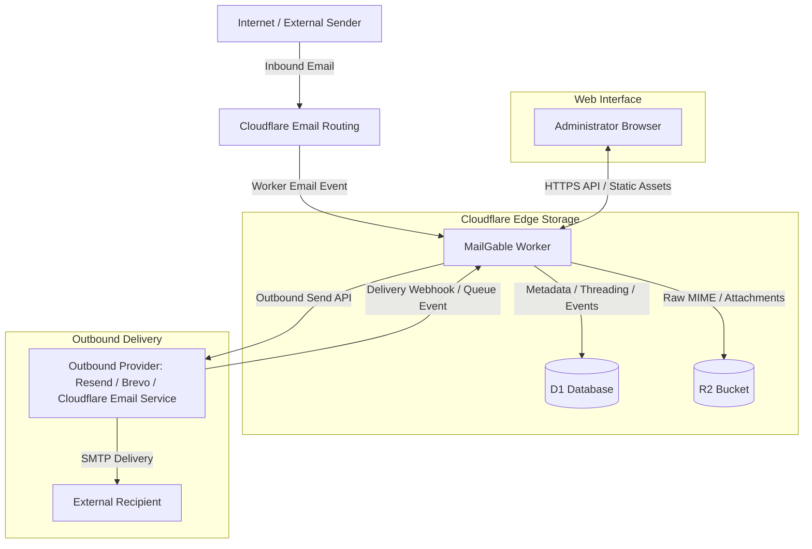
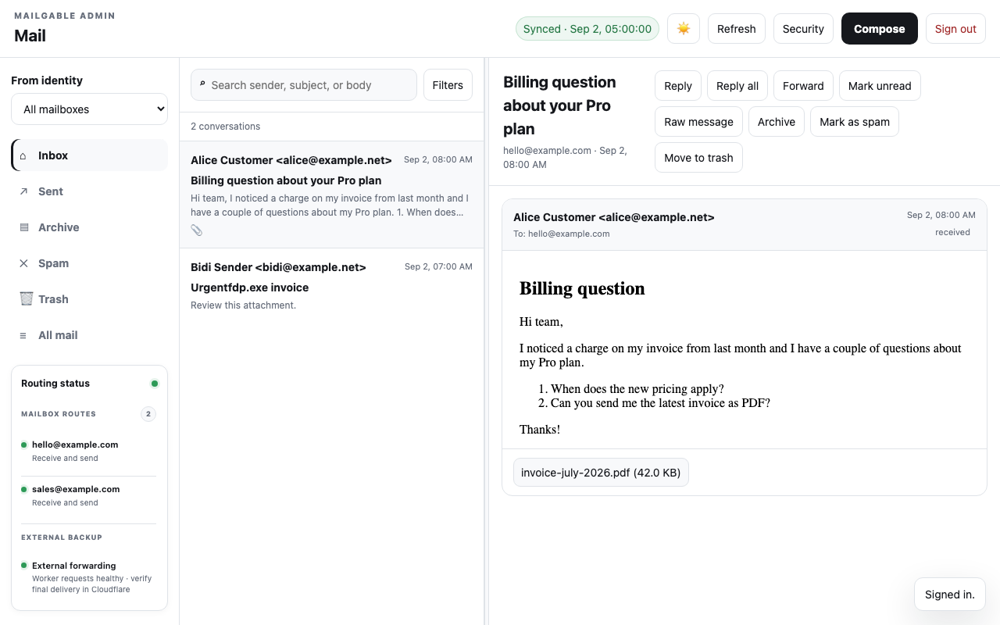
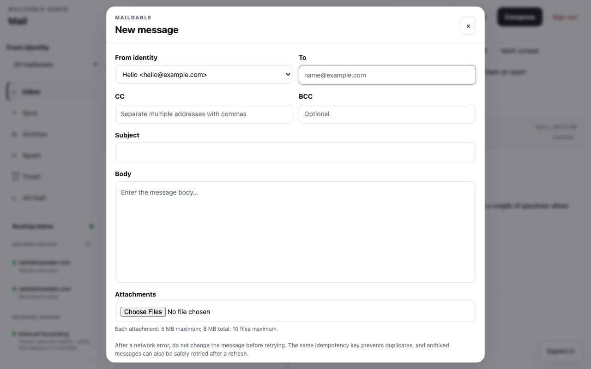
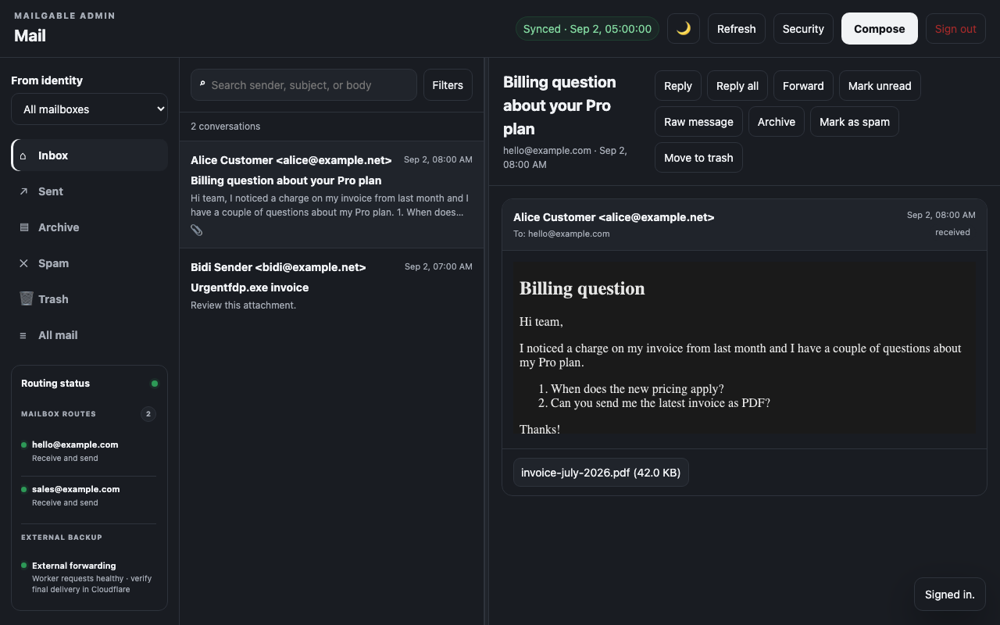
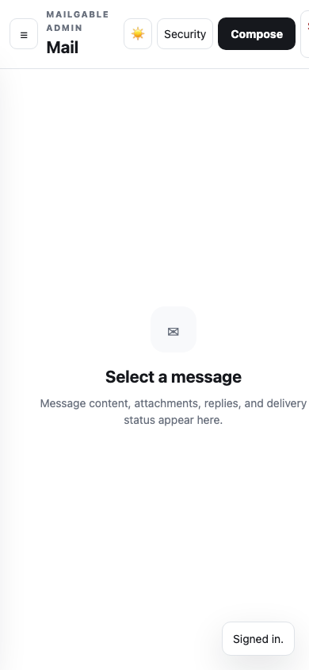

<div align="center">

# MailGable

**Self-hosted email inbox for Cloudflare Workers, D1, and R2.**

[](LICENSE)

[Quick Start](#quick-start) · [How it works](#how-it-works) · [Documentation](docs/README.md) · [Deployment](docs/DEPLOY.md) · [Roadmap](docs/ROADMAP.md) · [Security](SECURITY.md)

</div>



Receive through Cloudflare Email Routing, archive raw mail durably in D1/R2, read and reply from the built-in web console, and send through a pluggable outbound provider — without running an SMTP server, IMAP server, or VPS.

## Why MailGable

* **Own your archive** — raw MIME and attachments live in your own private R2 bucket; metadata and threading are queryable in D1.
* **Use your own domain** — native Cloudflare Email Routing; no mail server to operate.
* **Read and reply in the browser** — compose, reply, and forward from a responsive admin console.
* **Know what happened** — signed provider events reconcile delivery state with idempotent, monotonic status merging.
* **Safe retries** — unknown provider outcomes can be retried with the same idempotency key.
* **Mailbox identities that follow your routes** — add `orders@yourdomain.com` without touching code.

## Quick Start

Requires Node.js 22.23.2 and npm ≥ 10 (pinned in `.nvmrc` / `.node-version`).

```bash
git clone https://github.com/XiantingWu/MailGable.git
cd MailGable
npm ci
npm run check     # typecheck + tests + migration smoke + dry-run + repository gates
npm run dev       # local worker with local D1
```

`npm run check` must pass with zero production credentials. Full walkthrough: [docs/QUICKSTART.md](docs/QUICKSTART.md). Deployment: [docs/DEPLOY.md](docs/DEPLOY.md).

## How it works



Full design and invariants: [docs/ARCHITECTURE.md](docs/ARCHITECTURE.md).

## Design choices

| Property | MailGable |
| :--- | :--- |
| Hosted service | No — you deploy it into your own Cloudflare account |
| Managed data plane | No — D1 and R2 stay in your account |
| Cloudflare-native | Yes — Workers, D1, R2, Email Routing |
| Inbound email | Cloudflare Email Routing → Worker `email()` handler |
| Outbound email | Pluggable provider: Resend, Brevo, or Cloudflare Email Service; receive-only needs none |
| License | Apache-2.0 |
| Hosted SLA / commercial support | None |

## Features

* **Inbound** — Cloudflare Email Routing captures mail; unknown recipients are rejected at the edge.
* **Archive** — raw `.eml` and attachments stored in private R2 with `sha256` integrity.
* **Threading** — replies threaded via `In-Reply-To`/`References`, with provider-id reconciliation.
* **Folders** — Inbox, Sent, Archive, Spam, Trash, with restore and R2-consistent permanent deletion.
* **Delivery tracking** — signed webhooks, replay protection, per-recipient status, safe retries.
* **Optional forwarding / BCC** — `INBOUND_FORWARD_TO` and `AUTO_BCC_ADDRESSES`; `AUTO_BCC_REQUIRED` fails closed.
* **Security** — 15+ character passphrases, PBKDF2-SHA256 with pepper, hashed session tokens, strict CSRF, sandboxed HTML rendering, private archives.
* **Operations** — storage probes, daily retention cleanup, audit log.

## Screenshots

Screenshots use deterministic demo data; the routing and sync indicators shown are illustrative and do not represent a live deployment.

| Thread view | Compose |
| :--- | :--- |
|  |  |

| Dark theme | Mobile |
| :--- | :--- |
|  |  |

## Documentation

The full handbook lives in [`docs/`](docs/README.md), organised by task. Highlights:

| Start here | |
| :--- | :--- |
| [Quick Start](docs/QUICKSTART.md) | Local checkout to validated install |
| [Deployment](docs/DEPLOY.md) | Fresh Cloudflare account → working inbox |
| [Configuration](docs/CONFIGURATION.md) | Runtime variables, secrets, password policy |
| [Architecture](docs/ARCHITECTURE.md) | Design, data model, invariants |
| [Operations](docs/OPERATIONS.md) | Day-2 operations, backups, retention |
| [Troubleshooting](docs/TROUBLESHOOTING.md) / [FAQ](docs/FAQ.md) | When something goes wrong |

## Roadmap

Directional, maintainer-led: see [docs/ROADMAP.md](docs/ROADMAP.md).

## Contributing

Issues, bug reports, feature requests, and documentation suggestions are welcome. MailGable is maintainer-led; please open an issue before substantial code changes. See [CONTRIBUTING.md](CONTRIBUTING.md).

## Security

Report vulnerabilities privately — never in a public issue. See [SECURITY.md](SECURITY.md) and [docs/SECURITY_MODEL.md](docs/SECURITY_MODEL.md).

## License

Licensed under the [Apache License, Version 2.0](LICENSE).
