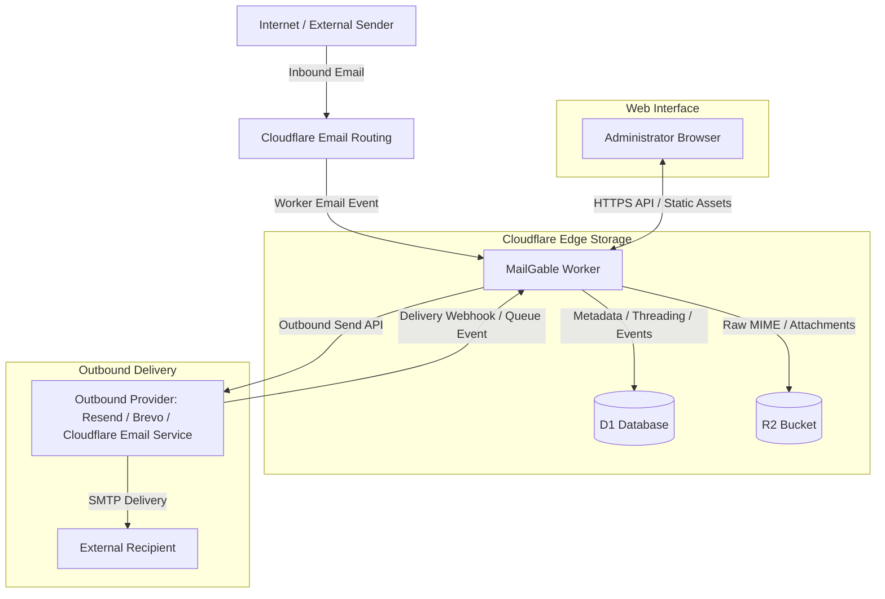

# Architecture

MailGable is a self-hosted mailbox stack that runs entirely on Cloudflare: inbound email arrives through Cloudflare Email Routing, metadata and threading live in D1 (SQLite), and raw MIME plus attachments are archived in private R2 objects. A built-in web console is served by the same Worker.

## High-level flow



## Source layout

```
src/
├── index.ts                 Worker entry: routing, static assets, scheduled cleanup
├── auth.ts                  Administrator sessions, PBKDF2 hashing, rate limiting
├── lib.ts                   Shared primitives, security headers, delivery-status helpers
├── inbound-forwarding.ts    Optional external forwarding copies (per-target tracking)
├── routing-sync.ts          Runtime Cloudflare Email Routing synchronization
├── log.ts                   Structured JSON logging with secret redaction
├── mail/                    Mailbox domain modules
│   ├── constants.ts         Limits, status sets, delivery ranks
│   ├── types.ts             Shared mail types
│   ├── helpers.ts           Parsing, validation, MIME helpers
│   ├── mailbox.ts           Mailbox identities
│   ├── threads.ts           Thread model, listing, detail, status transitions
│   ├── archive.ts           R2 object paths, raw download, storage probe
│   ├── attachments.ts       Attachment archival, integrity, download
│   ├── inbound.ts           Email event ingestion (Email Routing)
│   ├── outbound.ts          Compose, idempotent send, retry, forward
│   ├── delivery-events.ts   Provider webhook/event ingress (Resend, Brevo, Cloudflare queue)
│   ├── retention.ts         Retention policy and hard deletion
│   └── status.ts            Health, routing status, configuration status
└── providers/
    ├── registry.ts          OutboundProvider boundary: selection, pinning, capabilities
    ├── resend.ts            OutboundProvider implementation for Resend
    ├── brevo.ts             OutboundProvider implementation for Brevo
    ├── cloudflare-email.ts  OutboundProvider implementation for Cloudflare Email Service
    ├── resend-webhook.ts    Resend raw-body signature verification
    ├── events.ts            Provider event normalization + shared delivery-event application
    └── types.ts             Provider contract types
```

The frontend is plain ES modules under `public/js/` (no build step):

```
public/
├── index.html
├── mail.css / mail-ready.css / routing-status.css
└── js/
    ├── app.mjs        Entry point and event wiring
    ├── state.mjs      Shared state, API client, UI helpers
    ├── i18n.mjs       Centralized administrative-interface copy (English)
    ├── auth.mjs       Sign-in, bootstrap, password change
    ├── mailbox.mjs    Route sync, mailbox list, health
    ├── messages.mjs   Thread list, conversation, lifecycle actions
    ├── compose.mjs    Compose, reply, forward
    └── routing.mjs    Cloudflare routing status panel
```

## Provider architecture

The outbound boundary lives in `src/providers/registry.ts` (`OutboundProvider`).
Each provider implements the contract in `src/providers/types.ts`:

* **Resend** (`resend.ts`) — sending API key; webhook delivery events verified
  with the raw-body Svix signature; 24-hour provider idempotency key.
* **Brevo** (`brevo.ts`) — single sending API key (also the default management
  key); webhook delivery events authenticated with a Bearer token; ~30-minute
  provider idempotency TTL.
* **Cloudflare Email Service** (`cloudflare-email.ts`) — `send_email` binding,
  no runtime sending token; delivery events arrive via a Queue Event
  Subscription consumed by the Worker.

Provider selection and pinning:

* `getOutboundProvider(env)` selects the configured active provider.
* `providerForMessage(env, message)` pins retries to the provider recorded on
  the archived message — switching the active provider never re-routes an
  in-flight message to a different provider.
* Provider-specific retry/idempotency contracts are exposed per provider
  (e.g. `safeRetryWindowMs`) and are never copied across providers.

Delivery events (`providers/events.ts` + `mail/delivery-events.ts`):

* Each provider's payload is normalized (`NormalizedDeliveryEvent`) into a
  shared shape; Resend uses the Svix id, Brevo a deterministic key, Cloudflare
  the queue `eventId` (with a deterministic fallback).
* Events are applied through one shared monotonic path: `applyDeliveryEvent`
  merges statuses by rank, never regressing a delivered/terminal state.
* A pre-mutation fast path returns `duplicate: true` without touching the
  message when the same `(provider, provider_event_id)` is already recorded;
  the final `INSERT OR IGNORE` plus `UNIQUE(provider, provider_event_id)`
  remains the concurrent race guard.
* Cloudflare queue events are accepted only for `source.type=email.sending`
  and the official `cf.email.sending.message.*` lifecycle events; Email
  Routing inbound events are never mixed into delivery processing.

## Data model

D1 tables (see `migrations/`):

* `admins`, `admin_sessions`, `auth_attempts`, `admin_audit_log` — administration and audit
* `mailboxes` — mailbox identities (`address`, `display_name`, `can_receive`, `can_send`, `active`, `routing_managed`)
* `mail_threads` — conversations with folder `status` (`open` / `archived` / `spam` / `trash`)
* `mail_messages` — inbound and outbound messages with archive state and delivery status
* `mail_attachments` — attachment metadata with `sha256` and `r2_object_key`
* `mail_delivery_events` — provider delivery events (provider + provider_event_id unique)
* `inbound_forward_attempts` — per-target external forwarding state
* `mail_ops_probes` — storage read/write/delete probes

R2 layout:

```
incoming/<mailbox>/<year>/<month>/<message>/original-*.eml
incoming/<mailbox>/<year>/<month>/<message>/attachments/<id>-<filename>
outgoing/<mailbox>/<year>/<month>/<message>/...
health/probe-*.txt
```

## Key invariants

* **Archive-before-send**: outgoing messages are fully archived (raw + attachments) before the provider is contacted, so retries are always possible.
* **Idempotent sending**: a client-chosen `Idempotency-Key` with a payload hash prevents duplicates; the safe retry window is provider-specific (Resend 23h below its 24h key validity, Brevo 25m below its ~30m TTL; Cloudflare assumes no provider idempotency and never auto-retries unknown outcomes).
* **Monotonic delivery state**: provider delivery events merge statuses by rank; out-of-order, duplicate, or replayed events cannot regress a message state.
* **Duplicate events are no-ops**: an already-recorded `(provider, provider_event_id)` skips all message mutation.
* **Complete-or-fail forwarding**: external forwarding is per-target tracked; one target failing never blocks the archive.
* **R2-first, fail-closed deletion**: hard deletion removes every archive object (batched) before touching D1; any R2 failure preserves the metadata intact and a retry completes the deletion.

## Related documents

* [Deployment](DEPLOY.md)
* [Configuration](CONFIGURATION.md)
* [Security model](SECURITY_MODEL.md)
* [Routing](ROUTING.md)
* [Data retention](DATA_RETENTION.md)
* [API](API.md)
* [Operations](OPERATIONS.md) / [Troubleshooting](TROUBLESHOOTING.md)
* [Migrations](MIGRATIONS.md)
* [Roadmap](ROADMAP.md)
* [Providers](providers/RESEND.md) / [Providers](providers/BREVO.md) / [Providers](providers/CLOUDFLARE_EMAIL.md)
